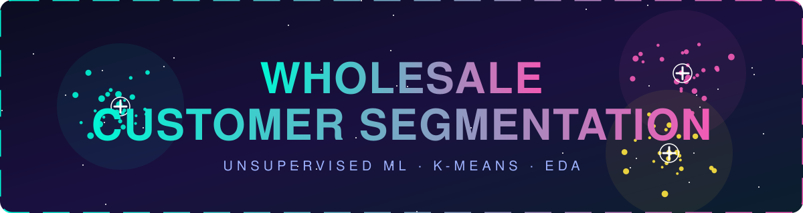
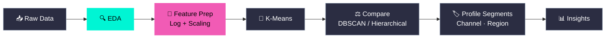

<div align="center">



<br/>

<a href="https://git.io/typing-svg"></a>

<br/>


</div>


## 🧭 Table of Contents

- [🎯 Project Goal](#-project-goal)
- [📦 Dataset](#-dataset)
- [🗺️ Pipeline](#️-pipeline)
- [🔍 EDA Findings](#-eda-findings)
- [🧠 Key Decisions](#-key-decisions)
- [✅ Progress & Roadmap](#-progress--roadmap)
- [🚀 Getting Started](#-getting-started)


## 🎯 Project Goal

Build an **end-to-end unsupervised machine learning project** that segments wholesale customers by their **purchasing behavior**, so each discovered segment can be understood, named, and acted on.

> *Who are the big spenders, who are the specialists, and who buys a bit of everything?*


## 📦 Dataset

**UCI Wholesale Customers**: 440 customers of a wholesale distributor.

| Type | Columns | Role |
|---|---|---|
| 🛒 Purchasing features | `Fresh` `Milk` `Grocery` `Frozen` `Detergents_Paper` `Delicassen` | Used for clustering |
| 🏷️ Categorical metadata | `Channel` `Region` | Held back for cluster **profiling** |


## 🗺️ Pipeline



<sub>🟢 Completed &nbsp;•&nbsp; 🩷 Up next &nbsp;•&nbsp; ⚫ Planned</sub>


## 🔍 EDA Findings

Data quality checks (structure, missing values, duplicates, data types) and descriptive statistics were completed first. Then the deeper analysis:

### 1️⃣ Distributions: everything is right-skewed

<div align="center">

</div>

Most customers spend modestly, while a small group spends enormously. `Delicassen` (11.15) is the most extreme.

> ⚠️ **ML implication:** strong skew lets huge values dominate distance calculations in distance-based clustering.

### 2️⃣ Outliers: detected with the IQR method

`Lower = Q1 − 1.5 × IQR` &nbsp;|&nbsp; `Upper = Q3 + 1.5 × IQR`

Spending can't be negative, so the **upper bound** is what matters.

| Feature | Upper Bound | Outliers |
|---|---:|---:|
| Fresh | 37,642.75 | 20 |
| Milk | 15,676.13 | 28 |
| Grocery | 23,409.88 | 24 |
| **Frozen** | 7,772.25 | **43** 🔥 |
| Detergents_Paper | 9,419.88 | 30 |
| Delicassen | 3,938.25 | 27 |

> 📌 These are **feature-level** counts. One customer can be an outlier in several features, so they don't equal unique customers.

### 3️⃣ Correlations: spending moves together

| Feature Pair | Correlation | Strength |
|---|---:|---|
| Grocery ↔ Detergents_Paper | **0.92** | 🔥🔥🔥 Very strong |
| Milk ↔ Grocery | **0.73** | 🔥🔥 Strong |
| Milk ↔ Detergents_Paper | **0.66** | 🔥 Fairly strong |

Customers who buy lots of Grocery also tend to buy lots of Detergents_Paper. Other relationships were weaker.


## 🧠 Key Decisions

<details open>
<summary><b>🚫 Why we are NOT deleting outliers</b></summary>
<br/>

In customer segmentation, an unusually high-spending customer may be a **genuine segment** the algorithm should discover. Deleting them risks erasing the most valuable customers from the analysis.

K-Means uses distance to centroids, so extreme customers can pull centroids toward themselves. The plan is to handle this with transformations and algorithm comparison rather than deletion.

</details>

<details open>
<summary><b>🔗 Why we are NOT dropping correlated features (yet)</b></summary>
<br/>

High correlation (e.g. Grocery ↔ Detergents_Paper at 0.92) does not automatically mean a feature should be removed for clustering. We keep all six purchasing features for now.

</details>

<details open>
<summary><b>🏷️ Why Channel & Region are excluded from clustering</b></summary>
<br/>

The goal is to segment by **purchasing behavior**. Channel and Region are categorical metadata, so we use them *after* clustering to profile and interpret the segments.

</details>

<details>
<summary><b>🔬 Alternatives to investigate later</b></summary>
<br/>

- Log transformation
- DBSCAN
- Hierarchical clustering (note: it does **not** automatically solve the outlier problem, since extreme points still influence distances)
- Side-by-side comparison of clustering approaches

</details>


## ✅ Progress & Roadmap

- [x] Dataset structure inspection
- [x] Missing-value, duplicate and data-type checks
- [x] Descriptive statistics
- [x] Distribution & skewness analysis
- [x] Outlier analysis (IQR) + boxplots
- [x] Correlation analysis
- [x] Feature-selection reasoning
- [ ] **Feature preparation** ← *you are here*
  - [ ] What problem does **log transformation** solve?
  - [ ] What problem does **StandardScaler** solve?
  - [ ] Why use **both** before K-Means?
- [ ] K-Means clustering + choosing *k*
- [ ] Compare with DBSCAN / hierarchical clustering
- [ ] Cluster profiling with Channel & Region
- [ ] Final insights & business interpretation


## 🚀 Getting Started

```bash
# clone the repo
git clone https://github.com/Kartikshard/Whole-Sale-Customer-Segmentation.git
cd Whole-Sale-Customer-Segmentation

# install dependencies
pip install pandas numpy matplotlib seaborn scikit-learn jupyter

# launch the notebook
jupyter notebook
```


<div align="center">

**⭐ If this project helped you, consider giving it a star! ⭐**


</div>