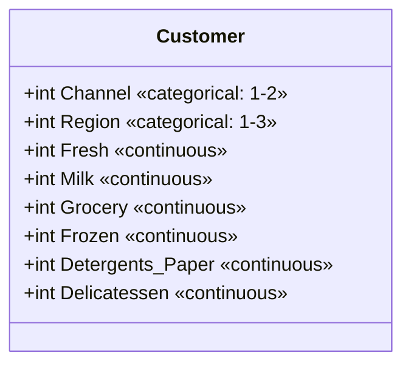
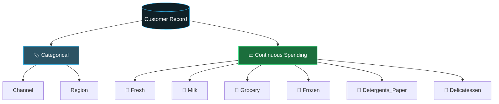

<div align="center">


<a href="https://git.io/typing-svg">
  
</a>

</div>

---

## 📑 Contents

1. [Dataset Summary](#1--dataset-summary)
2. [Schema at a Glance](#2--schema-at-a-glance)
3. [Column Definitions](#3--column-definitions)
4. [Categorical Code Books](#4--categorical-code-books)
5. [Column Relationships](#5--column-relationships)
6. [Validation Rules](#6--validation-rules)
7. [Sample Records](#7--sample-records)
8. [Validation Script](#8--validation-script)
9. [Notes and Caveats](#9--notes-and-caveats)

---

## 1. 📌 Dataset Summary

| Property | Value |
|----------|-------|
| **Subject** | Annual spending of wholesale customers by product category |
| **Granularity** | One row = one customer |
| **Total columns** | 8 |
| **Categorical columns** | 2 (`Channel`, `Region`) |
| **Continuous columns** | 6 (spending features) |
| **Unit of spending** | m.u. (monetary units), annual |
| **Missing values expected** | None |
| **Primary key** | None (row index acts as customer ID) |

---

## 2. 🧬 Schema at a Glance





---

## 3. 📖 Column Definitions

| # | Column | Data Type | Variable Type | Allowed Values / Range | Nullable | Description |
|:-:|--------|:---------:|:-------------:|------------------------|:--------:|-------------|
| 1 | `Channel` | `int` | Categorical (nominal) | `1`, `2` | No | Sales channel / customer type of the client |
| 2 | `Region` | `int` | Categorical (nominal) | `1`, `2`, `3` | No | Geographic region of the customer |
| 3 | `Fresh` | `int` | Continuous | `≥ 0` | No | Annual spending (m.u.) on fresh products |
| 4 | `Milk` | `int` | Continuous | `≥ 0` | No | Annual spending (m.u.) on milk products |
| 5 | `Grocery` | `int` | Continuous | `≥ 0` | No | Annual spending (m.u.) on grocery products |
| 6 | `Frozen` | `int` | Continuous | `≥ 0` | No | Annual spending (m.u.) on frozen products |
| 7 | `Detergents_Paper` | `int` | Continuous | `≥ 0` | No | Annual spending (m.u.) on detergents and paper products |
| 8 | `Delicatessen` | `int` | Continuous | `≥ 0` | No | Annual spending (m.u.) on delicatessen products |

---

## 4. 🗂️ Categorical Code Books

### 🏨 `Channel`

| Code | Label | Icon |
|:----:|-------|:----:|
| `1` | Hotel | 🏨 |
| `2` | Restaurant | 🍽️ |

### 📍 `Region`

| Code | Label | Icon |
|:----:|-------|:----:|
| `1` | Lisbon | 🏙️ |
| `2` | Oporto | 🌉 |
| `3` | Other | 🗺️ |

**Ready-to-use mapping**

```python
CHANNEL_MAP = {1: "Hotel", 2: "Restaurant"}
REGION_MAP  = {1: "Lisbon", 2: "Oporto", 3: "Other"}
```

---

## 5. 🔗 Column Relationships

| Group | Columns | Relationship |
|-------|---------|--------------|
| Customer profile | `Channel`, `Region` | Describe *who* and *where* the customer is |
| Spending profile | `Fresh`, `Milk`, `Grocery`, `Frozen`, `Detergents_Paper`, `Delicatessen` | Describe *what* the customer buys |
| Derived (optional) | `Total_Spend = sum of 6 spending columns` | Overall annual spend per customer |
| Derived (optional) | `<Category>_Share = category / Total_Spend` | Spending mix per customer |

---

## 6. ✅ Validation Rules

| Rule ID | Column(s) | Rule | Severity |
|:-------:|-----------|------|:--------:|
| R1 | all | No null values | 🔴 Error |
| R2 | `Channel` | Must be in `{1, 2}` | 🔴 Error |
| R3 | `Region` | Must be in `{1, 2, 3}` | 🔴 Error |
| R4 | spending columns | Must be integers `≥ 0` | 🔴 Error |
| R5 | spending columns | Extreme outliers (e.g. above 99th percentile) should be reviewed | 🟡 Warning |
| R6 | all | No fully duplicated rows | 🟡 Warning |
| R7 | row | `Total_Spend > 0` (customer should buy something) | 🟡 Warning |

---

## 7. 🧾 Sample Records

> Illustrative format only. Replace with real rows from your file.

| Channel | Region | Fresh | Milk | Grocery | Frozen | Detergents_Paper | Delicatessen |
|:-------:|:------:|------:|-----:|--------:|-------:|-----------------:|-------------:|
| 2 | 3 | 12669 | 9656 | 7561 | 214 | 2674 | 1338 |
| 2 | 3 | 7057 | 9810 | 9568 | 1762 | 3293 | 1776 |
| 1 | 3 | 6353 | 8808 | 7684 | 2405 | 3516 | 7844 |

---

## 8. 🧪 Validation Script

```python
import pandas as pd

df = pd.read_csv("wholesale_customers.csv")

spend_cols = ["Fresh", "Milk", "Grocery", "Frozen", "Detergents_Paper", "Delicatessen"]

checks = {
    "R1 no nulls":           df.isna().sum().sum() == 0,
    "R2 Channel in {1,2}":   df["Channel"].isin([1, 2]).all(),
    "R3 Region in {1,2,3}":  df["Region"].isin([1, 2, 3]).all(),
    "R4 spend >= 0 (int)":   (df[spend_cols] >= 0).all().all()
                             and all(pd.api.types.is_integer_dtype(df[c]) for c in spend_cols),
    "R6 no duplicates":      not df.duplicated().any(),
    "R7 total spend > 0":    (df[spend_cols].sum(axis=1) > 0).all(),
}

for rule, ok in checks.items():
    print(f"{'✅' if ok else '❌'} {rule}")

# Quick profile
print(df[spend_cols].describe().T[["mean", "std", "min", "50%", "max"]])
```

---

## 9. ⚠️ Notes and Caveats

- **Channel labels:** The original UCI *Wholesale customers* dataset documents `Channel` as `1 = Horeca (Hotel/Restaurant/Café)` and `2 = Retail`. This dictionary uses the labels from your project description (`1 = Hotel`, `2 = Restaurant`). Confirm against your data source.
- **Skewness:** Spending columns are usually heavily right-skewed. Consider a `log1p` transform before modeling.
- **Categorical codes:** `Channel` and `Region` are stored as integers but are **nominal**, not numeric. Do not treat them as ordered or scale them as continuous features.
- **Units:** All spending is in *monetary units (m.u.)*, annual totals per customer.

---

<div align="center">


</div>